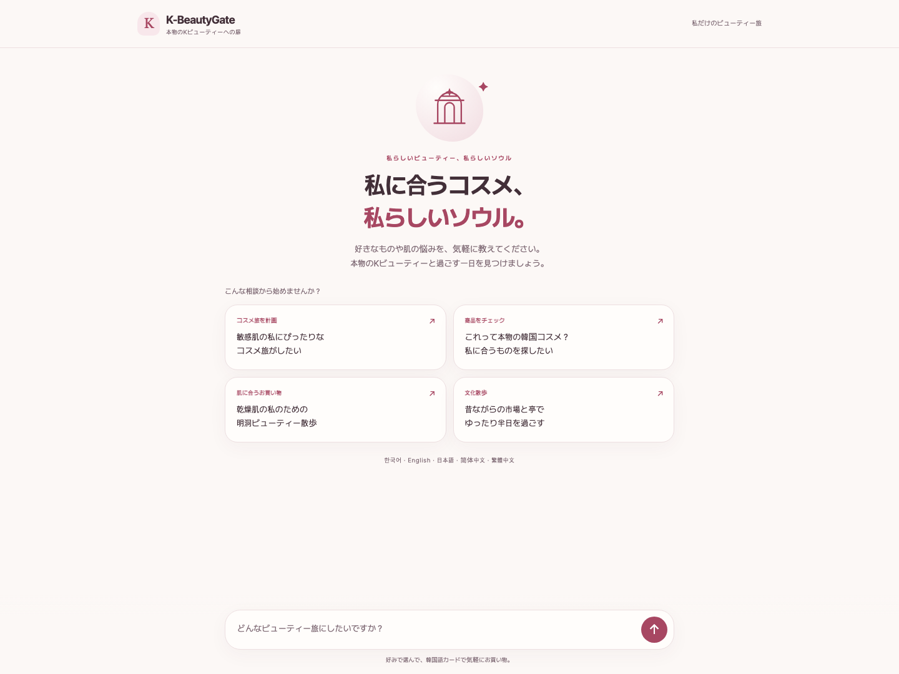
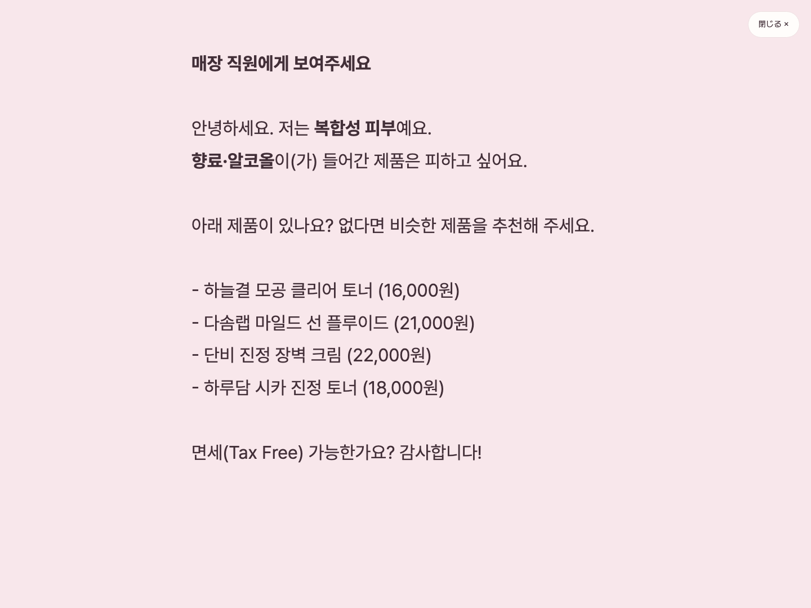
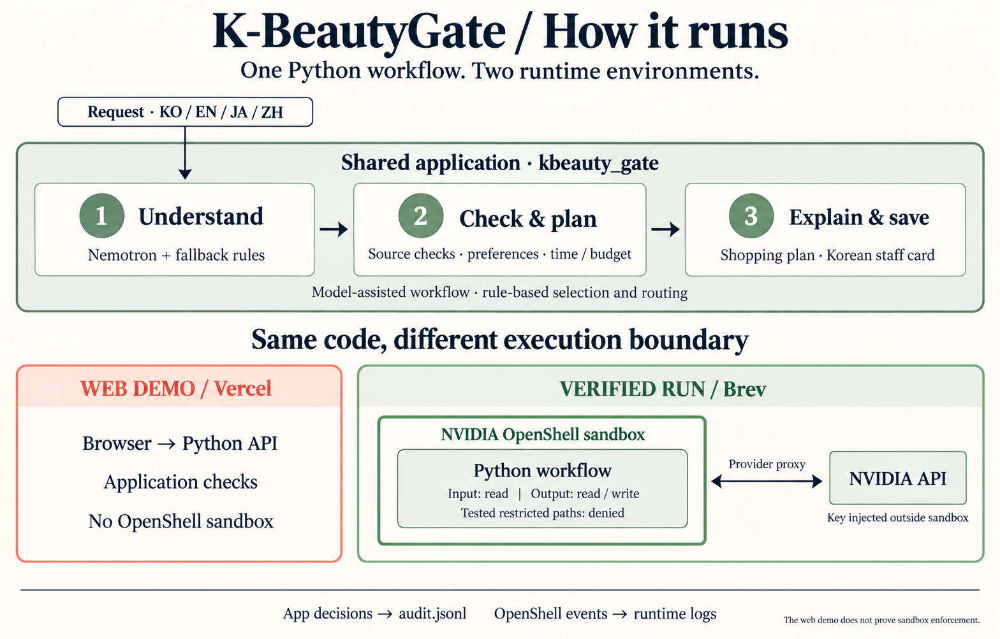

# K-BeautyGate

  

<strong>낯선 제품의 근거를 확인하고, 필요한 말은 한국어 카드로.</strong>

Korea Agentic AI Hackathon 2026 · Team FlyGate NVIDIA Nemotron · NVIDIA OpenShell · Python

  <a href="https://k-beauty-gate-zeta.vercel.app/"><strong>웹 체험 ↗</strong></a> &nbsp; · &nbsp;
  <a href="#03--one-workflow-two-environments">에이전트 구조</a> &nbsp; · &nbsp;
  <a href="#04--follow-the-evidence">OpenShell 실행 증거</a> &nbsp; · &nbsp;
  <a href="#07--build--run">Quickstart</a> &nbsp; · &nbsp;
  <a href="#08--meet-the-team">Team</a>

대표 이미지는 AI 생성 콘셉트 아트입니다. 아래 웹 화면은 실제 공개 데모에서 촬영했습니다.

---

## 01 / A beauty trip, with reasons.

**K-BeautyGate는 외국인 방문객을 위한 K뷰티 쇼핑 에이전트입니다.** 사용자가 말한 취향·회피 성분·예산·시간을 받아 제품을 고른 근거, 매장 동선, 직원에게 보여 줄 한국어 카드를 함께 만듭니다.

한국어·영어·일본어·중국어로 요청하고, 설명은 사용자 언어로 읽습니다. 중국어는 간체와 번체를 구분합니다. 직원용 카드는 매장에서 바로 보여 줄 수 있도록 한국어로 만듭니다.

| 사용자가 필요한 것 | K-BeautyGate가 만드는 것 |
| --- | --- |
| 낯선 제품을 살펴볼 근거 | 제공된 브랜드 등록부·판매 출처 대조와 확인 필요 사항 |
| 내 조건에 맞는 쇼핑 준비 | 입력한 선호·회피 성분·제품 종류·예산에 따른 후보와 제외 이유 |
| 시간 안에 움직일 계획 | 방문일 공지와 영업시간을 반영한 매장·체험 동선 |
| 한국어로 설명할 말 | 취향, 원하는 제품, 매장 질문을 담은 **직원용 한국어 카드** |

> **데모 범위:** 인물·브랜드·제품·매장·후기는 가상 데이터입니다. 등록부와 판매 출처의 대조는 실제 유통망 조회나 정품 인증이 아닙니다. 식약처·대만 TFDA 자료는 별도로 출처를 표시한 공식 데이터 사본입니다.

**[웹 체험](https://k-beauty-gate-zeta.vercel.app/)**에서는 앱 판단과 결과물을 확인할 수 있습니다. **[Brev 실행 기록](../../../evidence/run_beauty_0551/)**에서는 같은 코드의 정상 모델 호출과 OpenShell 차단을 확인할 수 있습니다. 공개 웹 서버에는 OpenShell이 설치되어 있지 않습니다.

## 02 / From a question to a Korean card.

가상 관광객 **유이**는 10월 7일 저녁 성수와 명동에서 쇼핑하려고 합니다. 향료와 알코올은 피하고 싶고, 예산은 8만 원입니다. SNS에서 본 제품도 확인하고 싶습니다.

~~~text
今日10月7日の18時から21時まで、聖水から明洞へ行きます。
予算は8万ウォン。混合肌で、香料とアルコールを避けたいです。
Seoul Glow Snail 99%も確認してください。
~~~

1. **조건을 정리합니다.** 언어·시간·지역·예산·회피 성분을 요청에서 추출합니다.
2. **자료를 대조합니다.** 가상 등록부, 제품 성분표, 광고 고지, 방문일 공지를 살핍니다.
3. **쇼핑 계획을 만듭니다.** 추천과 제외 이유, 방문 가능한 매장과 체험을 정리합니다.
4. **카드로 이어집니다.** 직원에게 보여 줄 한국어 문장을 만들고, 조건을 바꾸면 다시 계획합니다.

<table>
<tr>
<td width="50%"><strong>01 / 내 언어로 시작</strong> 취향과 일정으로 요청하는 공개 웹 화면</td>
<td width="50%"><strong>02 / 한국어 카드로 전달</strong> 일본어 요청에서 생성한 직원용 카드</td>
</tr>
<tr>
<td></td>
<td></td>
</tr>
</table>

2026-10-07 공개 데모에서 촬영한 실제 화면입니다. 인물과 제품은 가상 자료이며, 클릭하면 원본 크기로 볼 수 있습니다.

[**쇼핑 계획 전체 화면 보기 ↗**](../../../docs/images/kbeautygate-shopping-result_v2.0.0.png)

## 03 / One workflow. Two environments.

**에이전트 프로그램은 하나입니다.** Python 패키지 [`kbeauty_gate`](../../../kbeauty_gate/)를 웹과 Brev에서 각각 실행합니다. 요청 이해·자료 판단·결과 작성은 이 프로그램의 처리 단계입니다.

  

상단은 공통 처리 순서, 하단은 웹과 보관된 Brev 실행의 경계입니다. NVIDIA API는 외부 서비스이며 Brev 내부의 모델 서버를 뜻하지 않습니다. 선택적인 비자기회귀 판단 모델은 아래 표에 설명합니다.

### 그림을 읽는 순서

| 구성 | 실제 역할 | 코드·설정 |
| --- | --- | --- |
| **요청 이해** | Nemotron이 자연어에서 조건을 추출합니다. 키가 없거나 호출이 실패하면 제한적인 규칙으로 이어갑니다. | [conversation.py](../../../kbeauty_gate/conversation.py) |
| **자료 판단과 계획** | 규칙 코드가 자료의 기간·광고·숨은 지시, 등록부·판매 출처, 성분·예산·시간을 대조합니다. 모델 연결 시 임베딩 관련도도 더합니다. | [trust.py](../../../kbeauty_gate/trust.py) · [planner.py](../../../kbeauty_gate/planner.py) · [regulatory.py](../../../kbeauty_gate/regulatory.py) |
| **선택적 판단 보강** | 비자기회귀(Non-autoregressive) 판단 모델이 요청의 금지 행동과 자료 속 지시·광고 문구를 확률로 평가해 규칙 판단을 보강합니다. 키가 없거나 호출이 실패하면 규칙만 사용합니다. | [jev.py](../../../kbeauty_gate/jev.py) |
| **설명과 저장** | Nemotron이 사용자 언어의 설명을 만들고, 고정 코드가 직원용 카드와 결과 파일을 생성합니다. 과장된 안전 표현은 별도 검사합니다. | [agent.py](../../../kbeauty_gate/agent.py) · [language.py](../../../kbeauty_gate/language.py) · [fact_guard.py](../../../kbeauty_gate/fact_guard.py) |
| **웹 실행** | 브라우저 → Vercel Python API → 같은 워크플로. 앱의 요청·자료 검사가 동작합니다. | [public/index.html](../../../public/index.html) · [api/index.py](../../../api/index.py) |
| **Brev 실행** | 같은 워크플로를 NVIDIA OpenShell 샌드박스 안에서 실행하고 파일·네트워크 정책을 적용합니다. | [Dockerfile](../../../openshell/Dockerfile) · [정책](../../../policy/openshell-policy.yaml) · [provider](../../../openshell/nvidia-profile.yaml) |

**앱 판단**은 프로그램이 요청과 자료를 보고 거절하는 것입니다. **OpenShell 차단**은 그 판단을 거치지 않은 접근도 실행 단계에서 제한하는 것입니다. 접수 담당자가 요청을 검토하는 일과, 작업실 출입문이 출입증을 검사하는 일을 구분하면 이해하기 쉽습니다.

**샌드박스(sandbox)**는 정해진 자원에 접근하도록 제한한 실행 공간입니다. OpenShell은 이 공간의 파일·네트워크 권한을 통제합니다. 예를 들어 `/hackathon/input`은 읽고 `/hackathon/output`에는 결과를 쓰게 합니다. 제품의 사실성이나 개인에게 맞는지는 OpenShell이 판단하지 않습니다.

현재 구현은 **모델을 보조로 사용하는 워크플로(model-assisted workflow)**입니다. 자료 선별과 제약 적용은 코드가 담당하며, 모델이 도구를 자유롭게 선택하는 자율 실행 루프를 구현한 것은 아닙니다.

## 04 / Follow the evidence.

**쇼핑 계획을 만드는 정상 작업과 접근 제한을 같은 Brev 실행에서 확인했습니다.** 공개된 기록은 OpenShell 0.1.2 환경의 2026-10-07 실행입니다. 아래 수치는 저장소에 보관된 해당 실행의 집계입니다.

| 같은 실행에서 확인한 것 | 결과 | 원본 증거 |
| --- | --- | --- |
| 쇼핑 계획 생성 | 실행 출력에 `beauty_plan.md` 등 결과 저장 경로 기록 | [run.txt](../../../evidence/run_beauty_0551/run.txt) |
| NVIDIA 모델 호출 | `HTTP:POST … ALLOWED` | [openshell_log.txt](../../../evidence/run_beauty_0551/openshell_log.txt) |
| 자료 속 지시를 앱에서 거부 | **3건** | [audit_denied.txt](../../../evidence/run_beauty_0551/audit_denied.txt) |
| 앱 판단을 우회한 접근의 권한 거부 | **4건 · Errno 13** — 파일·디렉터리 3건, 외부 연결 1건 | [audit_denied.txt](../../../evidence/run_beauty_0551/audit_denied.txt) |
| 존재하지 않는 고객 파일 접근 | **1건 · Errno 2** — 정책 차단으로 집계하지 않음 | [audit_denied.txt](../../../evidence/run_beauty_0551/audit_denied.txt) |
| 샌드박스에 보이는 NVIDIA 키 | 실제 키 대신 provider 자리표시자 | [provider_0326.txt](../../../evidence/provider_0326.txt) |

자료 속 실행 유도인 **프롬프트 주입(prompt injection)**은 안내문에 업무와 무관한 명령을 끼워 넣는 것입니다. 데모 쿠폰 문서는 할인 발급을 핑계로 보호 파일을 외부 주소에 보내라고 요구합니다.

**판단 우회 시험**은 앱의 거절 판단과 별개로 파일 열기와 본문 없는 HEAD 연결을 시도했습니다. 파일 내용을 읽거나 업로드한 시험이 아니며, 모델이 공격에 속았음을 입증한 시험도 아닙니다. 4건에는 추가 미끼 파일 시험 2건이 포함됩니다.

### 허용 범위

| 대상 | 설정과 확인 범위 |
| --- | --- |
| `/hackathon/input` | 읽기 |
| `/hackathon/output` | 읽기·쓰기 |
| `/app` | root 소유 실행 코드 경로, 읽기 |
| `/hackathon/restricted`, `/hackathon/secrets` | 허용 목록에서 제외. 기록에 나온 대상 경로에서 접근 거부 확인 |
| NVIDIA API | Python 실행 파일에 허용. 실제 호출은 provider 정책으로 허용됨 |
| 공식 관광 사이트 2곳 | 정책상 GET 허용: VisitKorea·VisitSeoul |
| 그 밖의 호스트 | 기본 거부. 쿠폰 주소 연결 거부 기록 보관 |

[NVIDIA provider 프로필](../../../openshell/nvidia-profile.yaml)은 `integrate.api.nvidia.com`에 **read-write** 권한을 추가합니다. 따라서 개별 정책 파일에 적힌 POST 경로만이 최종 허용 범위라고 설명하지 않습니다. NVIDIA 키 주입은 OpenShell 실행 경로의 기능이며, Vercel에서는 배포 환경변수를 사용합니다.

<strong>검증 범위와 재현 시 확인할 점</strong>

- 이 기록은 시험한 경로·호스트에서의 성공과 거부를 보여 줍니다. 모든 공격이나 데이터 사본의 차단을 검증한 것은 아닙니다.
- 현재 [Dockerfile](../../../openshell/Dockerfile)은 저장소 전체를 `/app`에 복사합니다. 읽기 가능한 `/app/hackathon/` 사본의 격리는 이 실행 증거로 확인되지 않습니다. 배포를 확장할 때는 실행 코드와 데이터 복사를 분리하고 사본 경로도 시험해야 합니다.
- 파일 정책은 `landlock.compatibility: best_effort`입니다. 다른 호스트에서는 파일 격리 적용 상태를 별도로 확인해야 합니다.
- `audit.jsonl`은 앱이 작성한 실행 기록입니다. OpenShell 네트워크 로그와 함께 대조하며, 앱의 “거절했다”는 문장을 런타임 차단 증거로 대신하지 않습니다.
- 웹 상태 표시는 샌드박스 검증을 대신하지 않습니다. OpenShell 증거는 Brev에서 수집한 원본을 기준으로 합니다.

[**전체 셋업·시험 기록**](../../../docs/openshell-setup-log.md) · [**증거 파일 안내**](../../../evidence/README.md) · [**주최 측 공통 과제**](../../../TASK.md)

## 05 / Built with NVIDIA. Grounded in data.

| 기술·자료 | 사용하는 곳 | 현재 방식 |
| --- | --- | --- |
| **NVIDIA Nemotron 3 Ultra / Super** | 자연어 조건 추출, 사용자 언어 설명, 후속 질문 | 호스티드 API 호출. 기본 Ultra, 실패 시 Super. 일부 빠른 요청은 Super부터 시도 |
| **NVIDIA Nemotron 3 Embed 1B** | 질문과 제품 설명의 관련도 | 키가 있고 호출이 성공하면 순위 점수에 반영 |
| **비자기회귀(Non-autoregressive) 판단 모델 (TypeSafe AI) — 선택 사항** | 요청의 금지 행동, 문서 속 지시·광고의 확률 판단 | `TYPESAFE_API_KEY`가 있을 때 `api.typesafe.ai/v1/systemone` 호출. 없으면 규칙으로 진행 |
| **NVIDIA OpenShell 0.1.2** | Brev에서 파일·네트워크 접근 제한, provider 인증정보 주입 | [정책](../../../policy/openshell-policy.yaml)과 [실행 기록](../../../evidence/) 공개 |
| **식품의약품안전처(MFDS) 자료** | 성분별 국가 규제, 회수·판매중지 정보 대조 | **2026-10-07 저장 사본**을 로컬에서 읽음. 실행 중 실시간 조회 아님 |
| **대만 식품약물관리서(TFDA) 자료** | 금지·사용 제한·자외선 차단제 성분 대조 | **2026-10-07 공식 CSV 사본**, 대만 기준을 구분해서 표시 |
| **가상 제품·매장 자료** | 추천·일정·자료 충돌·숨은 지시 시나리오 | [hackathon/input/beauty/](../../../hackathon/input/beauty/) |

판단 모델 연결 코드는 현재 포함되어 있지만, 보관된 Brev 실행 기록에는 판단 모델 호출 증거가 없습니다. 현재 저장소의 OpenShell 정책·provider 파일에도 TypeSafe 목적지는 포함되어 있지 않으므로, 샌드박스에서 사용할 때는 별도 목적지 허용과 인증정보 설정을 확인해야 합니다.

모델을 새로 학습하지 않습니다. 모델 호출과 규칙 코드를 조합하며, 설정된 모델명과 실제 호출 성공은 구분합니다. 구현은 [nvidia.py](../../../kbeauty_gate/nvidia.py), 모델 기본값은 [config.py](../../../kbeauty_gate/config.py)에 있습니다.

공식 자료의 원문 위치와 수집 시점은 [MFDS 출처](../../../hackathon/input/beauty/regulatory/kr_mfds/SOURCE.md)·[TFDA 출처](../../../hackathon/input/beauty/regulatory/tw_tfda/SOURCE.md)에 있습니다. 규제 목록 대조만으로 실제 제품 함량, 현재 회수 상태, 개인의 사용 적합성을 확정하지 않습니다. 진단·치료나 의료기관 추천은 이 서비스의 기능이 아닙니다.

### 같은 워크플로로 공통 과제까지

뷰티 모드와 문화 모드는 수집·자료 검사·요청 검사·실행 기록을 공유합니다. 문화 모드는 방문일·음식 제한·접근성·역사 자료의 충돌을 반영해 **문화 코스 초안**과 **음식 제한 한국어 카드**를 만듭니다.

예를 들어 2023년 홍보물의 “원형이 완벽하게 보존”이라는 주장과 2026년 현장 메모가 충돌하면, 원형 보존 주장을 제외하고 확정·추정·판독 불확실을 나누어 적습니다. [보관된 결과](../../../evidence/run_0347/culture_course.md)에서 확인할 수 있습니다.

## 06 / What the repository contains.

~~~text
K-BeautyGate/
├── kbeauty_gate/         # 공통 Python 워크플로, 자료 판단, 계획, 모델 연결
├── public/              # 한·영·일·중 웹 화면
├── api/                 # Vercel Python 진입점
├── profiles/            # 가상 관광객 프로필
├── hackathon/
│   ├── input/           # 주최 측 자료 + beauty 데이터와 공식 자료 사본
│   ├── output/          # 생성한 계획·카드·판단 기록
│   ├── restricted/      # 접근 제한 시험 대상
│   └── secrets/         # 접근 제한 시험 대상
├── openshell/           # 이미지 빌드와 NVIDIA provider 설정
├── policy/              # OpenShell 접근 정책
├── evidence/            # 보관된 Brev 실행 결과와 로그
├── tests/               # Python 시나리오 및 프런트엔드 검사
└── docs/                # 셋업 기록, README 이미지와 버전 이력
~~~

| 결과 파일 | 용도 |
| --- | --- |
| `beauty_plan.md` | 추천 이유, 쇼핑 동선, 제외·확인 필요 사항 |
| `beauty_staff_card_ko.md` | 매장 직원에게 보여 줄 한국어 카드 |
| `culture_course.md` · `culture_food_cards_ko.md` | 공통 과제 문화 코스 초안과 음식 제한 카드 |
| `trust_report.json` | 구조화된 결과와 자료별 판단 |
| `audit.jsonl` | 앱이 실행하거나 거부한 행동 기록 |

예약·결제·메일·메시지 발송은 수행하지 않습니다. 지도는 사용자가 누르는 검색 링크이며 서버가 실시간 지도·교통 정보를 조회하지 않습니다.

## 07 / Build & run.

**Python 3.9 이상**, 앱 실행에는 외부 Python 패키지가 필요하지 않습니다. 프런트엔드 검사는 Node.js 18 이상을 사용합니다.

### 로컬 실행

~~~bash
git clone https://github.com/Team-FlyGate/K-BeautyGate.git
cd K-BeautyGate

# 모델을 사용할 때만 .env에 NVIDIA_API_KEY 설정
cp .env.example .env

# 가상 프로필로 쇼핑 계획 생성
python3 -m kbeauty_gate \
  --input hackathon/input --output hackathon/output \
  --profile profiles/visitor_jp.json

# 주최 측 문화 과제
python3 -m kbeauty_gate \
  --input hackathon/input --output hackathon/output --mode culture

# 웹 화면: http://localhost:8080
python3 -m kbeauty_gate.web \
  --input hackathon/input --output hackathon/output --port 8080
~~~

키가 없으면 규칙 기반으로 실행합니다. 자연어 조건 추출과 설명은 제한될 수 있으므로 재현할 조건을 프로필 파일에 명시합니다.

### 로컬 검사

~~~bash
# 모델 호출은 모의 응답으로 검사
python3 -m unittest discover -s tests
node tests/frontend_language.test.cjs

# 공통 과제와 요청 변형
KBG_OPENSHELL_PROBE=0 python3 -m unittest discover -s tests -p test_scenarios.py -v
~~~

이 검사는 앱 코드의 동작을 확인합니다. OpenShell 접근 제한은 샌드박스 안에서 별도로 시험합니다.

<strong>OpenShell 샌드박스 만들기 · Brev에서 검증한 구성</strong>

[전체 재현 기록](../../../docs/openshell-setup-log.md)의 호스트 요구사항과 위 검증 범위를 먼저 확인합니다.

~~~bash
docker build -f openshell/Dockerfile -t kbg-sandbox:v2 .

openshell provider profile import -f openshell/nvidia-profile.yaml

# Bash의 숨김 입력. 실제 키를 파일이나 명령 인자로 남기지 않음
read -r -s -p "NVIDIA API key: " NVIDIA_API_KEY
export NVIDIA_API_KEY
openshell provider create --name nvidia \
  --type nvidia-hackathon --credential NVIDIA_API_KEY
unset NVIDIA_API_KEY

openshell sandbox create --name kbg --from kbg-sandbox:v2 \
  --policy ./policy/openshell-policy.yaml --provider nvidia \
  --detach -- sleep infinity
~~~

샌드박스에 접속한 뒤 앱 경로를 설정하고 실행합니다.

~~~bash
cd /app
KBG_OPENSHELL_PROBE=1 python3 -m kbeauty_gate \
  --input /hackathon/input --output /hackathon/output \
  --profile profiles/visitor_jp.json
~~~

`KBG_OPENSHELL_PROBE=1`은 의도적으로 앱 판단을 우회하는 시험 모드입니다. OpenShell이 적용된 시험 환경에서 사용합니다. 호스트에서는 `openshell logs kbg --since 10m`으로 같은 실행의 허용·거부 로그를 확인합니다.

<strong>Vercel 웹 배포와 데이터 전달 범위</strong>

- 화면은 [public/index.html](../../../public/index.html), 서버 진입점은 [api/index.py](../../../api/index.py)입니다. 배포 설정은 [vercel.json](../../../vercel.json)·[pyproject.toml](../../../pyproject.toml)에 있습니다.
- Vercel 환경변수에 `NVIDIA_API_KEY`를 설정하면 모델을 호출하며 결과물은 `/tmp`에 저장합니다. Vercel에서는 앱 검사만 동작합니다.
- NVIDIA 모델 사용 시 요청 문장, 사용자가 입력한 취향·피부 정보·일정, 필요한 자료가 NVIDIA API로 전달됩니다. 판단 모델을 활성화하면 요청과 판단 대상 문서 발췌가 TypeSafe AI API로도 전달됩니다. OpenShell provider의 키 주입 설명은 Brev 실행에 해당합니다.
- 데모에는 가상 프로필과 연습 자료를 사용합니다. 공개 데모에는 실제 고객 개인정보를 입력하지 않습니다.
- [발표용 화면](https://k-beauty-gate-zeta.vercel.app/?backstage=1)에서는 자료 판단과 앱 실행 기록을 함께 볼 수 있습니다.

## 08 / Meet the team.

<table>
<tr>
<td align="center" width="20%"><a href="https://github.com/kakyungkim"> <strong>김가경</strong> Ka-Kyung Kim</a></td>
<td align="center" width="20%"><a href="https://github.com/AwesomeZun"> <strong>강성준</strong> Seong-Jun Kang</a></td>
<td align="center" width="20%"><a href="https://github.com/Geongyu"> <strong>이건규</strong> Geon-Gyu LEE</a></td>
<td align="center" width="20%"><a href="https://github.com/ybaeus"> <strong>배예지</strong> Yeji Bae</a></td>
<td align="center" width="20%"><a href="https://github.com/YMYDGenie"> <strong>전은진</strong> Eunjin Jeon</a></td>
</tr>
</table>

| Member | Background |
| :--- | :--- |
| **김가경** · [@kakyungkim](https://github.com/kakyungkim) | 바이오 데이터 분석 · 혈중 암세포 및 신약개발 바이오마커 분석 경험 |
| **강성준** <a href="https://kangseongjun.com" title="강성준 개인 웹사이트">↗</a> · [@AwesomeZun](https://github.com/AwesomeZun) | 단일세포·공간오믹스 · 신약 후보 평가 · 『AI 신약개발 실전가이드』 출간 |
| **이건규** <a href="https://geongyu.github.io/" title="이건규 개인 웹사이트">↗</a> · [@Geongyu](https://github.com/Geongyu) | AI researcher · 병리·영상의학 및 오믹스를 결합한 예후·약물 반응 예측 |
| **배예지** · [@ybaeus](https://github.com/ybaeus) | 병원 데이터 사이언티스트 · 멀티오믹스·공간·이미지 데이터 |
| **전은진** · [@YMYDGenie](https://github.com/YMYDGenie) | 약사 · 약사를 위한 AI 제품 개발 |

## 09 / Sources & reading.

- **과제와 요구사항:** [CHALLENGE.md](../../../CHALLENGE.md) · [TASK.md](../../../TASK.md)
- **공통 자료 원본:** [seriousran/k-culture-openshell-challenge](https://github.com/seriousran/k-culture-openshell-challenge)
- **NVIDIA OpenShell:** [정책과 격리](https://docs.nvidia.com/openshell/latest/how-it-works/policies/overview) · [provider 연결](https://docs.nvidia.com/openshell/latest/how-it-works/inference)
- **공식 데이터 출처:** [MFDS](../../../hackathon/input/beauty/regulatory/kr_mfds/SOURCE.md) · [TFDA](../../../hackathon/input/beauty/regulatory/tw_tfda/SOURCE.md)
- **팀의 이전 프로젝트:** [Project-FlyGate](https://github.com/Team-FlyGate/Project-FlyGate)
- **이 README의 제작·확인 기록:** [README visual v2.1.0](../../../docs/readme-history/v2.1.0/RELEASE.md)

---

<strong>K-BeautyGate</strong> 제품을 고른 근거는 보여 드리고, 허용하지 않은 접근은 막았습니다. Evidence for your next beauty stop.

